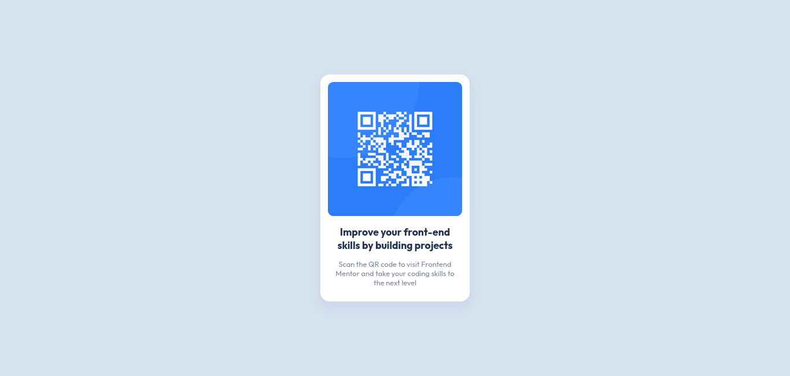

# Frontend Mentor - QR code component solution

This is a solution to the
[QR code component challenge on Frontend Mentor](https://www.frontendmentor.io/challenges/qr-code-component-iux_sIO_H).
Frontend Mentor challenges help you improve your coding skills by building
realistic projects.

## Table of contents

-   [Overview](#overview)
    -   [Screenshot](#screenshot)
    -   [Links](#links)
    -   [Built with](#built-with)

## Overview

Simple Solution to the QR Problem

### Screenshot

### Links

-   Solution URL:
    [Repository](https://github.com/kolostring/qr-code-component-main)
-   Live Site URL:
    [Live Site](https://kolostring.github.io/qr-code-component-main/)

### Built with

-   Semantic HTML5 markup
-   CSS custom properties
-   Flexbox
-   Mobile-first workflow
